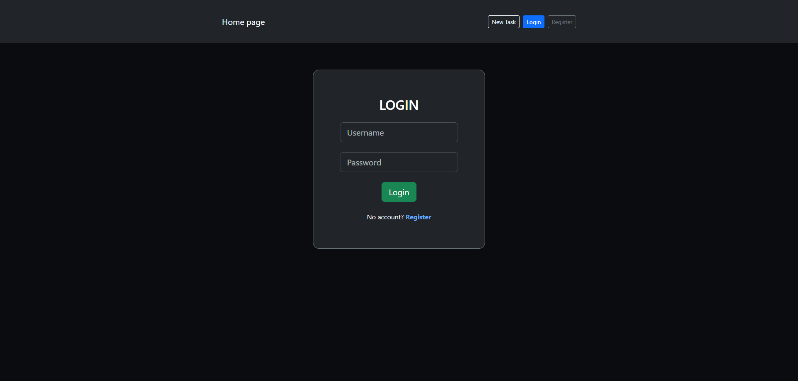
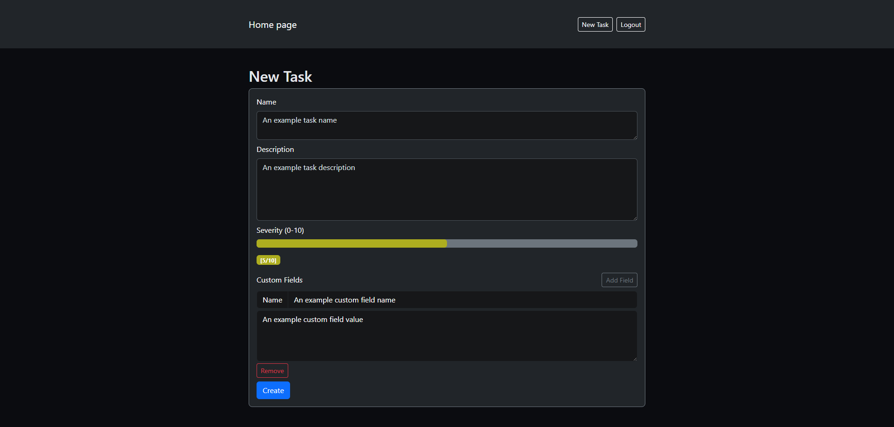
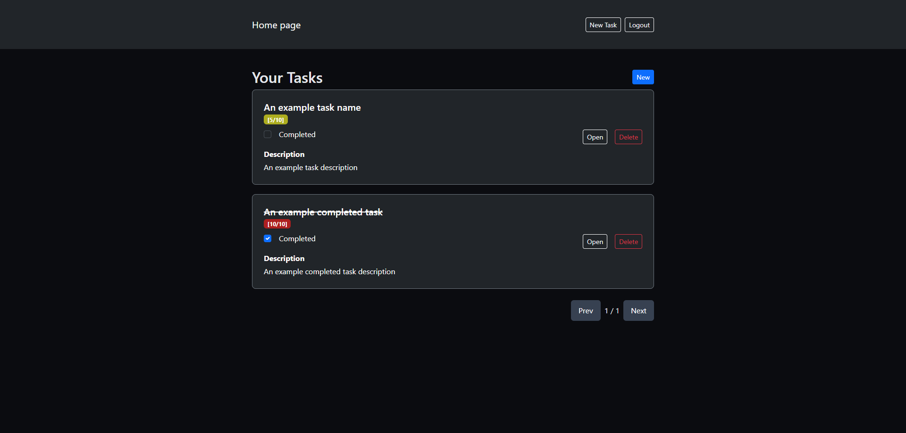

# Todo Front-end

This frontend utilizes [**ReactJS**](https://react.dev/) and [**hello-pangea/dnd**](https://github.com/hello-pangea/dnd) in order to make the task list reorderable.





## Local development

```bash
npm install
npm start
````

## License

[MIT](LICENSE)